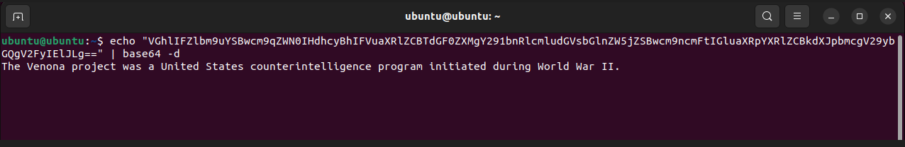
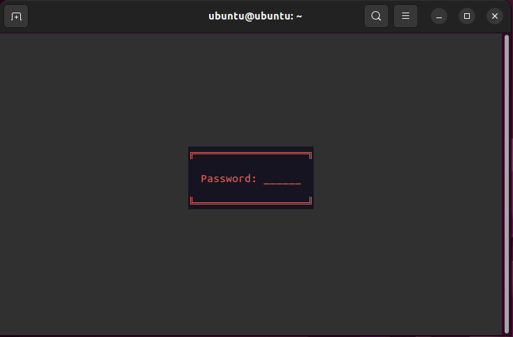
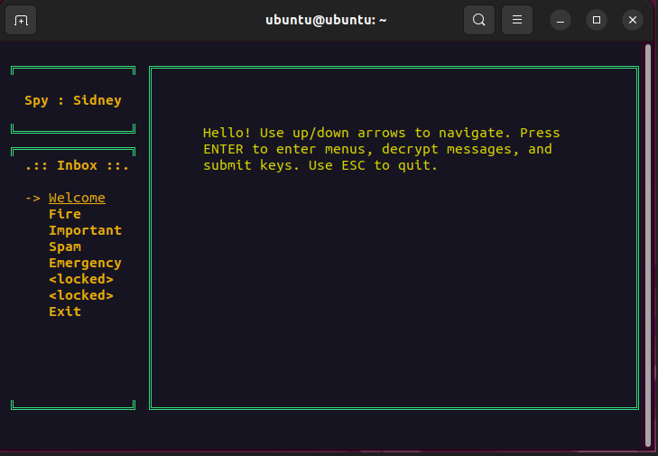
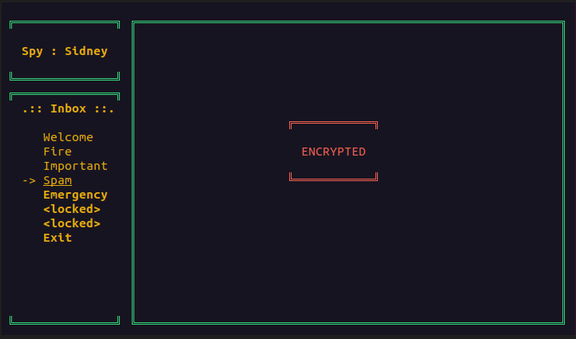
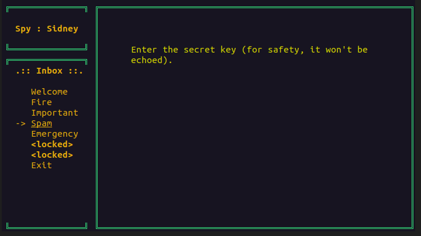
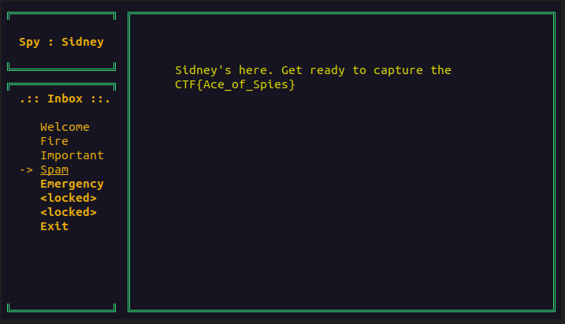

## Challenge 🧩

We captured enemy spy and intercepted a message. According to our crypt analysts, it's encrypted with an unbreakable cipher. Fortunately, the spy lacks key management skills and carried this key: "VGhlIFZlbm9uYSBwcm9qZWN0IHdhcyBhIFVuaXRlZCBTdGF0ZXMgY291bnRlcmludGVsbGlnZW5jZSBwcm9ncmFtIGluaXRpYXRlZCBkdXJpbmcgV29ybGQgV2FyIElJLg==". We sent you a copy of the message. Decrypt it. Your password is "Sidney".
Remember, connect to your terminal with the command:

```shell
socat file:`tty`,rawer tcp:otp0.2023-bq.ctfcompetition.com:1337
```

HINT: Decode the key first.

## Solution 🕵️‍♂️

First we will decode the key carried by spy.



Connecting Terminal

```shell
socat file:`tty`,rawer tcp:otp0.2023-bq.ctfcompetition.com:1337
```

After, we will prompted for password use `Sidney` as password





Next, Navigate to Spam folder



Press Enter to access the folder



Use the decoded key
> `The Venona project was a United States counterintelligence program initiated during World War II`



## Flag 🚩

`CTF{Ace_of_Spies}`
