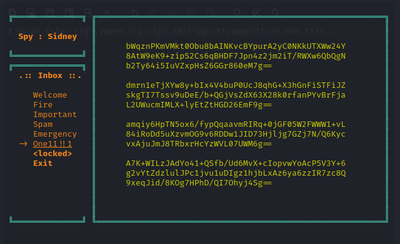

## Challenge 🧩

Phew, that was close... but you decrypted that one and escaped the ambush in time! Sidney Rilley, you've done it again. They almost got lucky this one time. The enemy continues to use unbreakable encryption. Hopefully, they made at least one mistake and you'll be able to find and exploit it. If they keep reusing the cipher, just like they repeatedly use your name, maybe we can eventually find a way to defeat it. Login to your terminal (your password is 'Sidney'). Maybe you can decrypt at least one of the messages.
Connect with the command:

```shell
socat file:`tty`,rawer tcp:otp1.2023-bq.ctfcompetition.com:1337
```

Ah, and by the way, our crypto experts said to try crib dragging but we couldn't find any infants around.
HINT: "multi-time pad" is a decent crib. The enemy thinks that the multi-time pad can't be broken.

## Solution 🕵️‍♂️

Connecting Terminal

```shell
socat file:`tty`,rawer tcp:otp1.2023-bq.ctfcompetition.com:1337
```

Navigate to One11 !! 1 folder



You can use any tool for crib dragging i am using modified version of [cribdrag - An interactive crib dragging tool by Daniel Crowley](https://github.com/SpiderLabs/cribdrag/blob/master/cribdrag.py) </br>

After Converting Base64 to Hex and XORing two Hex

```text
1b00544916450945111b00263635705a4828544812061c0c543b0c0d1c4517553105090d17595945271f1d1a064e1511060417434c0212155a496e202f1628551c150d74001e45241311250a751b0c1017040a0a030e0918

07001157534f1817451749313b24225d003a410e045745741c0d1c4911410052174c0e0f1d57571109111b4e04455410100d4e021903131003542a39235b3d14085a491d074d1531130d3d10200203004941380806020004
```

Using the known words we can crib drag on the each Hex to retrieve message and flag

```shell
python3 cribdrag.py <A_HEX_FROM_ABOVE>
```

```text
let's meet ASAP. I have their nuclear weapons technology. CTF{MultiTimePadIsUnbreakable}
we need to get that spy, Sidney Rilley. Fortunately, multi-time pad is truly unbreakable
keep our ciphers safe! They can't know that we use multi-time pad. In paritcular, Sidney
```

## Flag 🚩

CTF{MultiTimePadIsUnbreakable}
