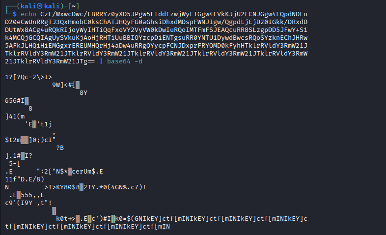
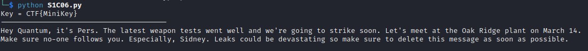

## Challenge 🧩

Consider us impressed, Sidney! We caught the spy leaking our weapons technology thanks to your outstanding crypto skills.
You deserve a promotion, sir! But first things first: we intercepted a message that's short. Key information hides in there.
Can you decrypt it? Connect to your terminal with the command:

```shell
socat file:`tty`,rawer tcp:otp2.2023-bq.ctfcompetition.com:1337
```

Your password is "Sidney". The enemy hasn't given up on the unbreakable encryption scheme just yet.
HINT: A short key repeats. If it was a one-byte key, you could use frequency analysis to find the key. How can you reduce the multi-byte key case to the one-byte case?

## Solution 🕵️‍♂️

Connecting Terminal

```shell
socat file:`tty`,rawer tcp:otp2.2023-bq.ctfcompetition.com:1337
```

Navigate to Short key folder


Decoding base64



`ctf[mINIkEY]` is the repeated key.

This appears to be repeating-key XOR.
> [Using Cryptopals Set 01 - Challenge 6 Solution by Riccardo Paccagnella](https://github.com/ricpacca/cryptopals/blob/master/S1C06.py)



### References

> `cryptopals.com/sets/1/challenges/6` </br>
> `github.com/ricpacca/cryptopals`

## Flag 🚩

`CTF{MiniKey}`
