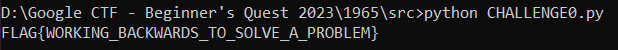
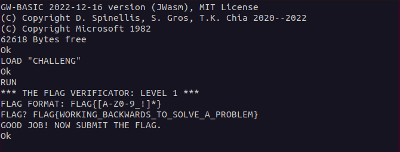

## Challenge 🧩

An array and a loop helped to hide a flag, can you reverse this to get the flag?

## Solution 🕵️‍♂️

### Let's break down this quirky piece of code step by step

`LINE 040` : The PREFIX variable specifies the common prefix to be added for FLAG{  </br>
`LINE 050`: The FL variable specifies length of the FLAG excluding FLAG{} </br>
`LINE 110 - 120`: Initialize the input variable and prompts the user to input a string.  </br>
`LINE 130 - 170`:  A loop runs in reverse through the characters of the input string U$. It grabs each character using MID$ and appends it to A$.  </br>
`LINE 900`: Contains the FLAG that needs to reversed.

> By Looking at LINE 900 we can see that the flag is `WORKING_BACKWARDS_TO_SOLVE_A_PROBLEM`

### Let's try to reverse the string using python

Here is the program and its output
> [CHALLENGE0.py](src/CHALLENGE0.py)



### Let's Verify the flag we got

Connecting Terminal </br>

```shell
 socat file:$(tty),rawer tcp:basic-01.2023-bq.ctfcompetition.com:1337
```


Load the program and run it


Verifying the FLAG we got



Exit the terminal by

`SYSTEM <enter>`

## Flag 🚩

`FLAG{WORKING_BACKWARDS_TO_SOLVE_A_PROBLEM}`
