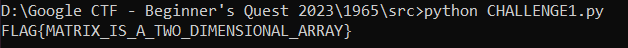

## Challenge 🧩

This one hides the flag somewhere in 2D. Can you retrieve the flag?

## Solution 🕵️‍♂️

### Let's break down this piece of code step by step

`LINE 040`: The PREFIX variable specifies the common prefix to be added for FLAG{ </br>
`LINE 050`: The FL variable specifies length of the FLAG excluding FLAG{} </br>
`LINE 110 - 120`: Initialize the input variable and prompts the user to input a string. </br>
`LINE 130 - 340`:  Contains variable declaration for number of rows and columns in our case 3X11. And program loops through each column and then through each row, printing the elements column by column. </br>
`LINE 900 - 920`: Contains the 2D matrix.

### Let's convert the 2D matrix using python

Here is the program and its output
> [CHALLENGE1.py](src/CHALLENGE1.py)

`Note: Part of the program is generated using Generative AI/GPT-3.5`



### Verify the flag we got

Connecting Terminal </br>

```shell
socat file:$(tty),rawer tcp:basic-02.2023-bq.ctfcompetition.com:1337`
```


Load the program and run it


Verifying the FLAG we got


Exit the terminal by entering

`SYSTEM <enter>`

## Flag 🚩

`FLAG{MATRIX_IS_A_TWO_DIMENSIONAL_ARRAY}`
