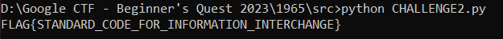
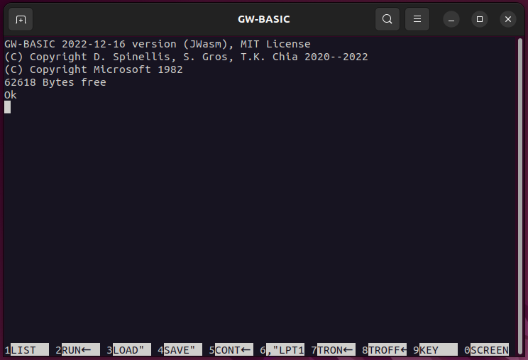
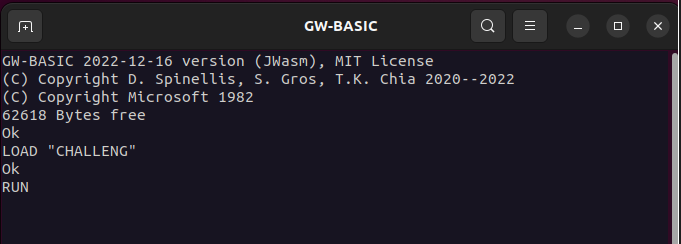

## Challenge 🧩

They told me to learn the standard code and the hexadecimal number system to get the flag.

## Solution 🕵️‍♂️

### Let's break down this piece of code step by step

`LINE 040`: The PREFIX variable specifies the common prefix to be added for FLAG{ </br>
`LINE 050`: The FL variable specifies length of the FLAG excluding FLAG{} </br>
`LINE 060 - 430`: Handles the user input and conversion Hexadecimal to Decimal then to ASCII by calling subroutine in `LINE 700 - 780`. </br>
`LINE 900 - 940`: Contains the FLAG in Hexadecimal.

### Hex Conversion using python

Here is the program and its output
> [CHALLENGE2.py](src/CHALLENGE2.py)

`Note: Part of the program is generated using Generative AI/GPT-3.5`



### Let's Verify the flag we got

Connecting Terminal

```shell
`$ socat file:$(tty),rawer tcp:basic-03.2023-bq.ctfcompetition.com:1337`
```



Load the program and run it



Verifying the FLAG we got


Exit the terminal

`SYSTEM <enter>`

## Flag 🚩

`FLAG{STANDARD_CODE_FOR_INFORMATION_INTERCHANGE}`
