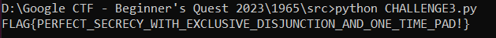
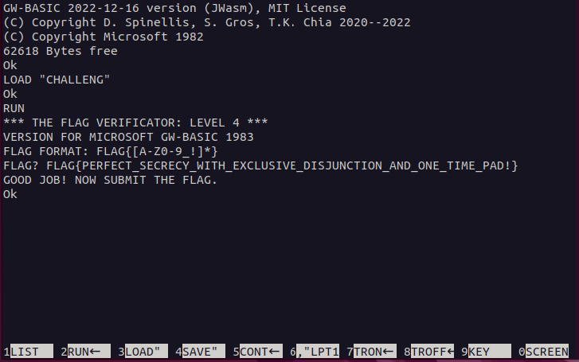

## Challenge 🧩

This last one offers the perfect cipher, can you decrypt the flag?

## Solution 🕵️‍♂️

### Let's break down this piece of code step by step

`LINE 040`: The PREFIX variable specifies the common prefix to be added for FLAG{ </br>
`LINE 050`: The FL variable specifies length of the flag excluding FLAG{} </br>
`LINE 060`: The SL variable specifies length of the KEY </br>
`LINE 110 - 460`: Handles Input and Decrypting of the flag. It appears to be performing XOR operation of KEY with ASCII Character of decimal value in encrypted data. </br>
`LINE 900`: Contains Encryption Key </br>
`LINE 910 - 950`: Contains Encrypted Flag

### Let's try to decrypt the data using python

Here is the program and its output
> [CHALLENGE3.py](src/CHALLENGE3.py)

`Note: Part of the program is generated using Generative AI/GPT-3.5`



### Let's Verify the flag we got

Connecting Terminal

```shell
socat file:$(tty),rawer tcp:basic-04.2023-bq.ctfcompetition.com:1337
```


Load the program and run it


Verifying the FLAG we got



Exit the terminal

`SYSTEM <enter>`

## Flag 🚩

`FLAG{PERFECT_SECRECY_WITH_EXCLUSIVE_DISJUNCTION_AND_ONE_TIME_PAD!}`
