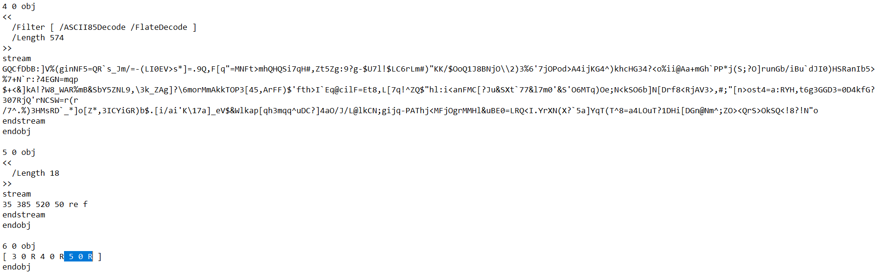
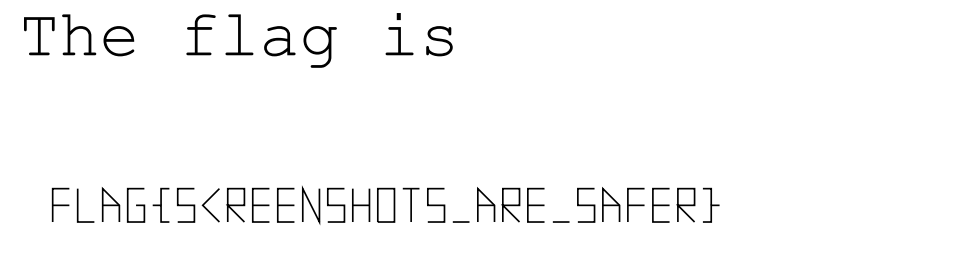

## Challenge 🧩

Your sources learned their lesson, and redacted the sensitive data properly this time. Or did they?

## Solution 🕵️‍♂️

Opening pdf file in text editor,  
Object 4 contains flag but its visibility is blocked by Object 5 we can remove entire Object 5 or remove reference to it in Object 6

After Modification

## Flag 🚩

`FLAG{SCREENSHOTS_ARE_SAFER}`
