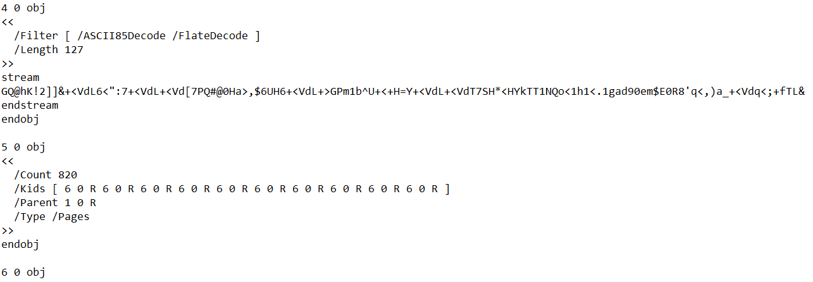
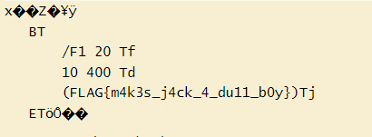

## Challenge 🧩

It's a busy day, and after getting another file, you immediately send it to printer without even looking inside. After some time you still can hear printer humming. You got a lot of paperwork to review.

## Solution 🕵️‍♂️

The file contains too many dummy blank pages, decode the ASCII85/Base85 Stream of Object 4

After decoding stream

`Tool Used: dCode/ascii-85-encoding`

## Flag 🚩

`FLAG{m4k3s_j4ck_4_du11_b0y}`
