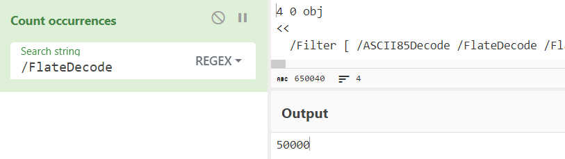
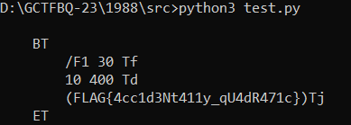

## Challenge 🧩

WHY HAS MY BROWSER TAB CRASHED!?

## Solution 🕵️‍♂️

After looking into file we can see there are 50000 instance of `/FlateDecode` in 4th Object thats why tab crashes.



After converting stream from ASCII85/Base85 we can see that the stream is a Zlib Deflate

```text
File type:   Zlib Deflate
Extension:   zlib
MIME type:   application/x-deflate
```

Using a simple script to decompress it

```python
import zlib

streamData = open('data.zlib', 'rb').read()

for i in range(50000):
    streamData = zlib.decompress(streamData)

print(streamData.decode('ascii'))
```



`Tool Used: CyberChef`

## Flag 🚩

`FLAG{4cc1d3Nt411y_qU4dR471c}`
