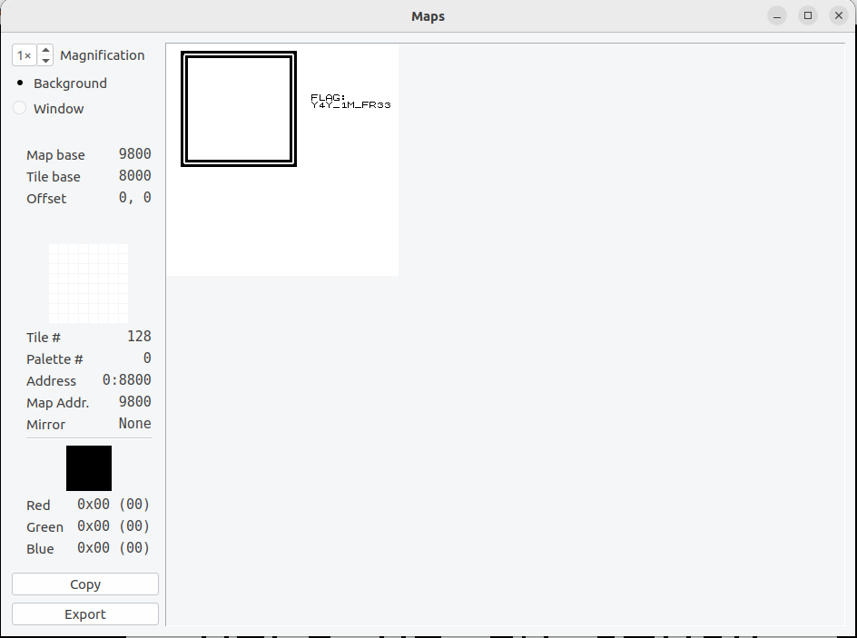

## Challenge 🧩

I'm stuck in this box and could really use your help. I know the flag is out there somewhere, I have a vague memory of seeing it. Can you find it for me please?

FLAG FORMAT: "FLAG: example_flag"

## Solution 🕵️‍♂️

Use any GBA emulator to load the given ROM, view the map of ROM you will find the FLAG

## Flag 🚩

`FLAG: Y4Y_1M_FR33`
