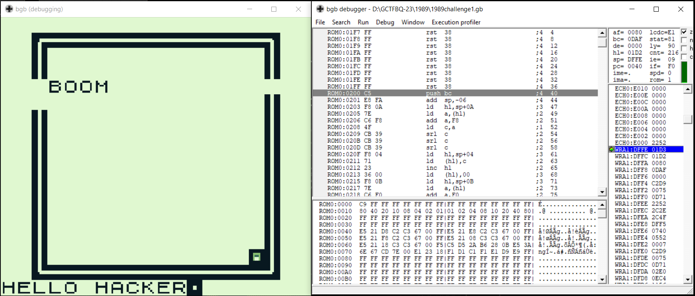
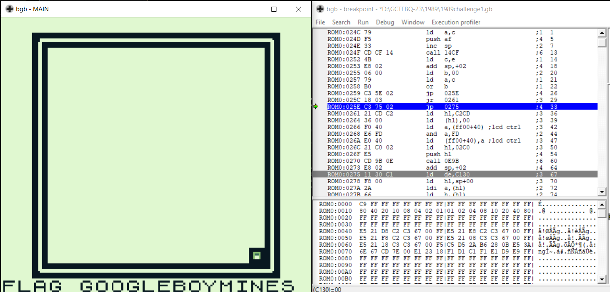

## Challenge 🧩

We have finally infiltrated into a mainframe. You need to get the dot to the other corner. Unfortunately, the path is riddled with mines. But I figure a Hacker like you can find a way around it?

FLAG FORMAT: "FLAG example"

## Solution 🕵️‍♂️

Initial Observation reveals that 6th move triggers mine we need to find the code block which checks for mine before hop

After some debugging i did find that `ROM0:0259 C2 5E 02 jp nz,025E` and `ROM:025E C3 75 02 jp 0275` are handling hop, After modifying `ROM0:0259` instruction to `jp z,025E` the mine triggers in next hop. So, after modifying jump instruction to `jp 025E` player will be able to hop without triggering mine.

We can reach the other end to get flag.

## Flag 🚩

`FLAG GOOGLEBOYMINES`
