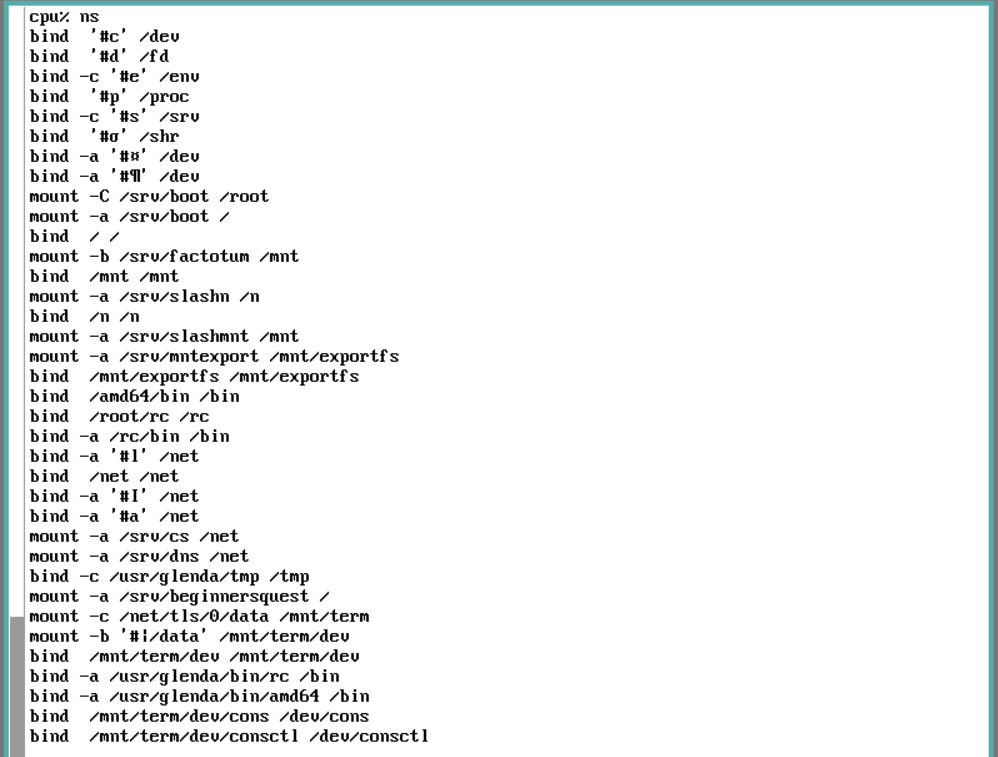
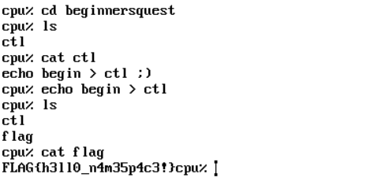

## Challenge 🧩

Hey we've got a disk image for you with this cool new OS called Plan9 installed on it.
The shell script provided will help you run it in QEMU and expose the right ports to your host machine.

Once you've got it running, you can log into it using drawterm-9front.
Use the default Plan9 host owner name and password 'welcome_to_the_machine'.

Remember, Plan9 is about namespaces, files and UTF-8. Now see if there is something interesting on that disk...

HINT: Does anything stand out to you in your current namespace ('ns' command)?

## Solution 🕵️‍♂️

After running ns command we can see `begginersquest` directory is mounted to system



After writing `begin` to `ctl` we get the flag

```bash
echo begin > ctl
```



## Flag 🚩

`FLAG{h3ll0_n4m35p4c3!}`
