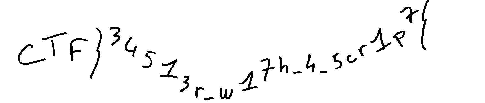

## Challenge 🧩

The flag was mistakenly written down. In a panic, the paper was shredded and thrown away. Time to go dumpster diving.

## Solution 🕵️‍♂️

> [!NOTE]
> Program / Part of the program is generated using Generative AI.

```text
Dependencies:
NumPy, Pillow (PIL) and tqdm
```

```python
import os
import numpy as np
from PIL import Image
try:
    from tqdm import tqdm
except ImportError:
    tqdm = None

# --- CONFIGURATION ---
folder_path = "shredded_data"
output_name = "reconstructed_rotated.png"
VARIANCE_THRESHOLD = 5.0
SWAP_COLUMNS = True 
ROTATE_LEFT = True  # Set to True to rotate 90 degrees counter-clockwise

def is_blank(img):
    return np.std(np.array(img.convert('L'))) < VARIANCE_THRESHOLD

def get_edge_mse(img1, img2):
    edge1 = np.array(img1.convert('L'))[:, -1].astype(float)
    edge2 = np.array(img2.convert('L'))[:, 0].astype(float)
    return np.mean((edge1 - edge2) ** 2)

# 1. INITIAL SCAN & LOGGING
print("-" * 40)
print("PHASE 1: IMAGE ANALYSIS")
print("-" * 40)

file_names = [f for f in os.listdir(folder_path) if f.lower().endswith(('.png', '.jpg', '.jpeg'))]
total_found = len(file_names)

active_images = {}
ignored_files = []

pbar_scan = tqdm(file_names, desc="Filtering blanks") if tqdm else file_names
for f in pbar_scan:
    img = Image.open(os.path.join(folder_path, f)).convert('RGB')
    if not is_blank(img):
        active_images[f] = img
    else:
        ignored_files.append(f)

print(f"\n[LOG] Total Files Found:    {total_found}")
print(f"[LOG] Ignored (Blank):      {len(ignored_files)}")
print(f"[LOG] Active (Used):        {len(active_images)}")

# 2. RECONSTRUCTION
print("\n" + "-" * 40)
print("PHASE 2: EDGE MATCHING")
print("-" * 40)

remaining_files = set(active_images.keys())
start_file = min(remaining_files, key=lambda f: np.mean(np.array(active_images[f].convert('L'))[:, 0]))

ordered_files = [start_file]
remaining_files.remove(start_file)

pbar_match = tqdm(total=len(remaining_files), desc="Stitching sequence") if tqdm else None
while remaining_files:
    last_img = active_images[ordered_files[-1]]
    best_match = min(remaining_files, key=lambda f: get_edge_mse(last_img, active_images[f]))
    if pbar_match: pbar_match.update(1)
    ordered_files.append(best_match)
    remaining_files.remove(best_match)
if pbar_match: pbar_match.close()

# 3. SWAP & ROTATE LOGIC
if SWAP_COLUMNS:
    print("\n[LOG] Applying Column Swap...")
    # mid = len(ordered_files) / 2
    # Change Based on the Input Images
    mid = 19
    ordered_files = ordered_files[mid:] + ordered_files[:mid]

# 4. RENDERING & ROTATION
print("\n" + "-" * 40)
print("PHASE 3: RENDERING & ROTATION")
print("-" * 40)

total_w = sum(active_images[f].width for f in ordered_files)
max_h = max(active_images[f].height for f in ordered_files)
canvas = Image.new('RGB', (total_w, max_h), (255, 255, 255))

curr_pos = 0
for f in ordered_files:
    canvas.paste(active_images[f], (curr_pos, 0))
    curr_pos += active_images[f].width

if ROTATE_LEFT:
    print("[LOG] Rotating image 90° Left...")
    # Image.ROTATE_90 rotates counter-clockwise
    canvas = canvas.transpose(Image.ROTATE_90)

canvas.save(output_name)

print(f"[LOG] Final Dimensions: {canvas.width}px x {canvas.height}px")
print(f"[LOG] Success! Saved as: {output_name}")
print("-" * 40)
```



## Flag 🚩

`CTF{34513r_w17h_4_5cr1p7}`
