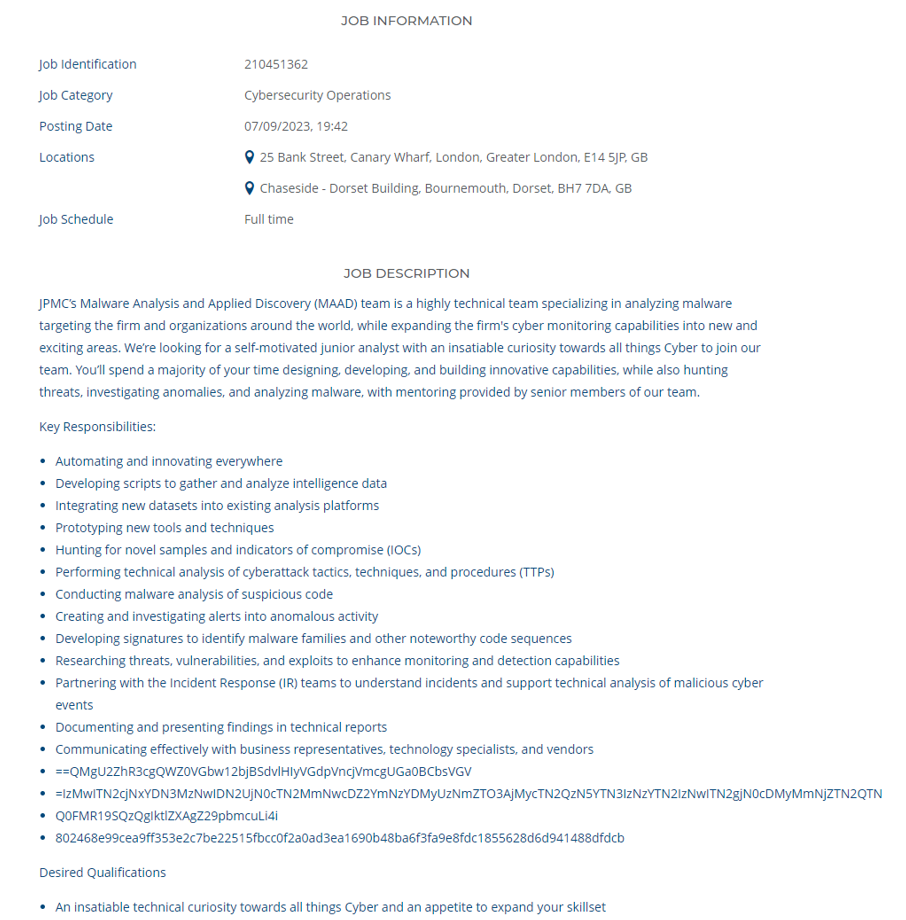
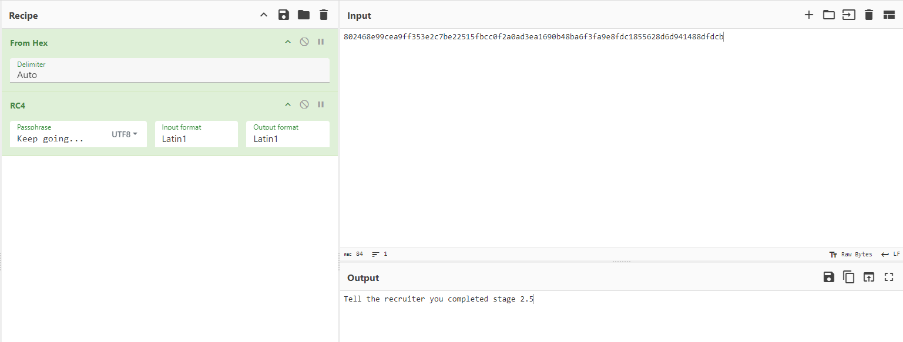

## Introduction

This is a fun challenge that caught my eye in job advert for Junior Developer & Intelligence / Malware Analyst at JPMC.



## Solution

```bash
┌──(user㉿shell)-[~]
└─$ echo ==QMgU2ZhR3cgQWZ0VGbw12bjBSdvlHIyVGdpVncjVmcgUGa0BCbsVGV | rev | base64 --decode
Tell the recruiter you completed stage 1
```

```bash
┌──(user㉿shell)-[~]
└─$ echo =IzMwITN2cjNxYDN3MzNwIDN2UjN0cTN2MmNwcDZ2YmNzYDMyUzNmZTO3AjMycTN2QzN5YTN3IzNzYTN2IzNwITN2gjN0cDMyMmNjZTN2QTN | rev | base64 --decode
54656c6c207468652072656372756974657220796f7520636f6d706c657465642073746167652032

┌──(user㉿shell)-[~]
└─$ echo 54656c6c207468652072656372756974657220796f7520636f6d706c657465642073746167652032 | xxd -r -p
Tell the recruiter you completed stage 2
```

```bash
┌──(user㉿shell)-[~]
└─$ echo Q0FMR19SQzQgIktlZXAgZ29pbmcuLi4i | base64 --decode                    
CALG_RC4 "Keep going..."
```



### Tool Used

> `CyberChef`
