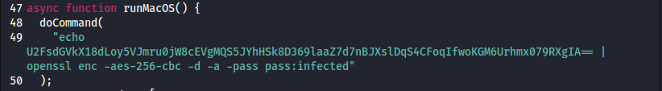

## Challenge 🧩

I'm just finding out about this blockchain thing and it's awesome! I can gamble all I want with no consequences! Checkout my new favorite app!

Author: alden </br>

## Solution 🕵️‍♂️

Let's extract the electron app pack `Contents/Resources/app.asar`

```bash
┌──(user㉿shell)-[~]
└─$ npx @electron/asar extract app.asar legit_crypto
```

After analyzing source code this snippet in `main.js` stands out



After running this we get the flag

```bash
┌──(user㉿shell)-[~]
└─$ echo U2FsdGVkX18dLoy5VJmru0jW8cEVgMQS5JYhHSk8D369laaZ7d7nBJXslDqS4CFoqIfwoKGM6Urhmx079RXgIA== | openssl enc -aes-256-cbc -d -a -pass pass:infected
*** WARNING : deprecated key derivation used.
Using -iter or -pbkdf2 would be better.
flag{6d0560223d733e5a6761476f8d23b4e3}
```

## Flag 🚩

`flag{6d0560223d733e5a6761476f8d23b4e3}`
