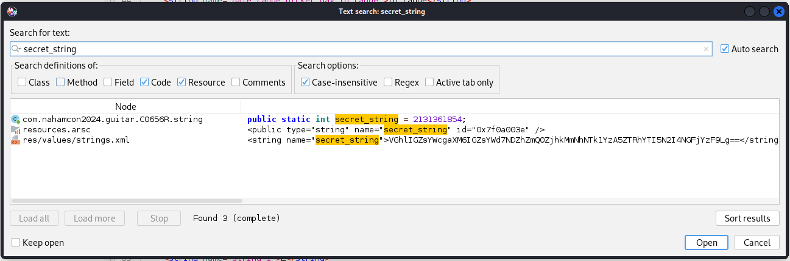

## Challenge 🧩

Have you ever wanted to play the guitar on your phone? Here's a free app, with all guitar strings included for free!

Author: matlac </br>

## Solution 🕵️‍♂️

Analyzing the apk using JADX, since description says `strings` included let's search for `secret string`



Decoding the Base64 encoded String

```bash
┌──(user㉿shell)-[~]
└─$ echo "VGhlIGZsYWcgaXM6IGZsYWd7NDZhZmQ0ZjhkMmNhNTk1YzA5ZTRhYTI5N2I4NGFjYzF9Lg==" | base64 -d
The flag is: flag{46afd4f8d2ca595c09e4aa297b84acc1}.
```

## Flag 🚩

`flag{46afd4f8d2ca595c09e4aa297b84acc1}`
