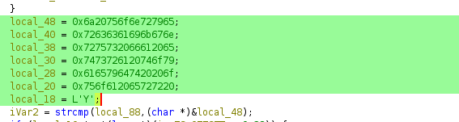
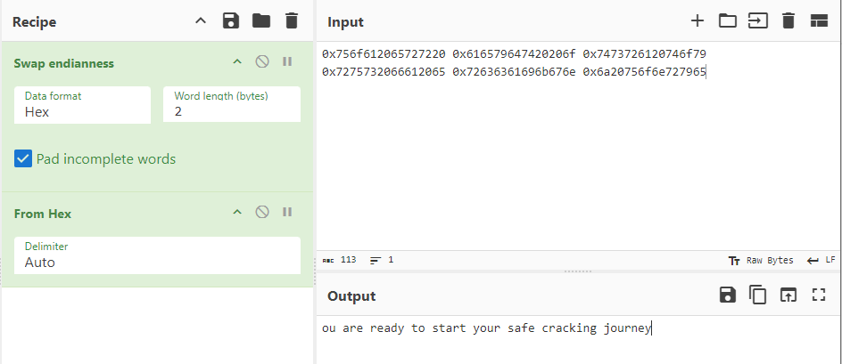
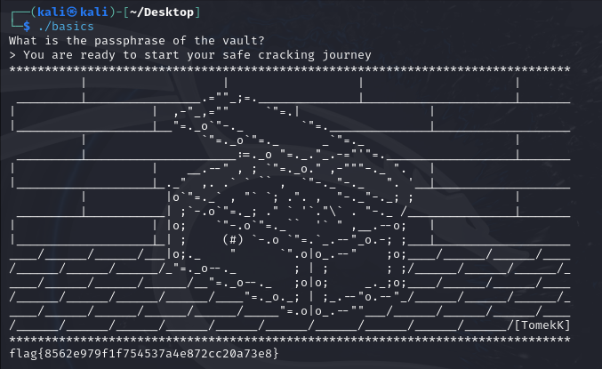

## Challenge 🧩

Let us start with a simple one and see if you can break into this vault.

NOTE, the plaintext that you provide the binary should be readable English. Reverse engineer the binary to understand what it really does... patching the binary will ultimately give you the wrong answer.

Author: awesome10billion  

## Solution 🕵️‍♂️

After decompiling the binary using Ghidra, check() function stands out.

After swapping endianness and converting from HEX, we get the passphrase of the vault.

### Tools Used

> `Ghidra`  
> `CyberChef`

## Flag 🚩

`flag{8562e979f1f754537a4e872cc20a73e8}`
