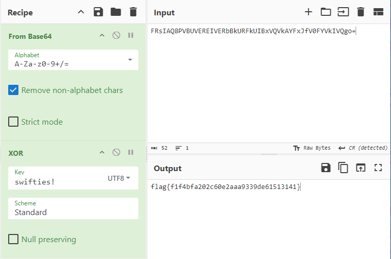

## Challenge 🧩

OMG did you hear that they named a programming language after Taylor Swift?

Author: alden </br>

## Solution 🕵️‍♂️

The binary is written in Swift Language, Lets open ghidra for reverse engineering.

We can see that function names are weird, because swift complier mangles the class, function and variable names. We can demangle this by using [SwiftNameDemangler](https://github.com/LaurieWired/iOS_Reverse_Engineering/blob/main/SwiftNameDemangler.py) Script.

After Demangling the flagCheck() function

```swift
/* Original: _$s6taylor9flagCheckySbSSF
   Demangled: flagCheck(_:) */

uint flagCheck(undefined8 param_1,undefined8 param_2)
{
  undefined *puVar1;
  uint uVar2;
  undefined8 uVar3;
  undefined8 uVar4;
  undefined8 uVar5;
  undefined8 uVar6;
  undefined *puVar7;
  undefined *puVar8;
  undefined auVar9 [16];
  undefined auVar10 [16];
  undefined local_68 [16];
  undefined local_58 [16];
  undefined local_48 [16];
  undefined8 local_38;
  undefined local_30 [16];
  undefined8 local_20;
  undefined8 local_18;
  
  puVar1 = PTR_type_metadata_for_UInt8_1000040a0;
  puVar8 = PTR_type_metadata_for_String.UTF8View_100004020;
  local_38 = 0;
  local_58._0_8_ = 0;
  local_58._8_8_ = 0;
  local_20 = param_1;
  local_18 = param_2;
  local_30 = String.utf8.getter();
  uVar3 = lazy_protocol_witness_table_accessor_for_type_String.UTF8View_and_conformance_String.UTF8V iew
                    ();
  uVar4 = Array.init_A_(local_30,puVar1,puVar8);
  local_38 = uVar4;
  local_48 = String.utf8.getter(param_1,param_2);
  uVar5 = Array.init_A_(local_48,puVar1,puVar8,uVar3);
  auVar9 = _allocateUninitializedArray_A_(9,puVar1);
  puVar7 = auVar9._8_8_;
  *puVar7 = 0x73;
  puVar7[1] = 0x77;
  puVar7[2] = 0x69;
  puVar7[3] = 0x66;
  puVar7[4] = 0x74;
  puVar7[5] = 0x69;
  puVar7[6] = 0x65;
  puVar7[7] = 0x73;
  puVar7[8] = 0x21;
  uVar6 = _finalizeUninitializedArray_A_(auVar9._0_8_,puVar1);
  auVar9 = xorEncrypt(uVar5);
  _swift_bridgeObjectRelease(uVar6);
  _swift_bridgeObjectRelease(uVar5);
  local_58 = auVar9;
  local_68 = String.utf8.getter();
  uVar3 = Array.init_A_(local_68,puVar1,puVar8,uVar3);
  auVar10 = _allocateUninitializedArray_A_(0x34,puVar1);
  puVar8 = auVar10._8_8_;
  *puVar8 = 0x46;
  puVar8[1] = 0x52;
  puVar8[2] = 0x73;
  puVar8[3] = 0x49;
  puVar8[4] = 0x41;
  puVar8[5] = 0x51;
  puVar8[6] = 0x38;
  puVar8[7] = 0x50;
  puVar8[8] = 0x56;
  puVar8[9] = 0x42;
  puVar8[10] = 0x55;
  puVar8[0xb] = 0x56;
  puVar8[0xc] = 0x45;
  puVar8[0xd] = 0x52;
  puVar8[0xe] = 0x45;
  puVar8[0xf] = 0x49;
  puVar8[0x10] = 0x56;
  puVar8[0x11] = 0x45;
  puVar8[0x12] = 0x52;
  puVar8[0x13] = 0x62;
  puVar8[0x14] = 0x42;
  puVar8[0x15] = 0x6b;
  puVar8[0x16] = 0x55;
  puVar8[0x17] = 0x52;
  puVar8[0x18] = 0x46;
  puVar8[0x19] = 0x6b;
  puVar8[0x1a] = 0x55;
  puVar8[0x1b] = 0x49;
  puVar8[0x1c] = 0x42;
  puVar8[0x1d] = 0x78;
  puVar8[0x1e] = 0x56;
  puVar8[0x1f] = 0x51;
  puVar8[0x20] = 0x56;
  puVar8[0x21] = 0x6b;
  puVar8[0x22] = 0x41;
  puVar8[0x23] = 0x59;
  puVar8[0x24] = 0x46;
  puVar8[0x25] = 0x78;
  puVar8[0x26] = 0x4a;
  puVar8[0x27] = 0x66;
  puVar8[0x28] = 0x56;
  puVar8[0x29] = 0x30;
  puVar8[0x2a] = 0x46;
  puVar8[0x2b] = 0x59;
  puVar8[0x2c] = 0x56;
  puVar8[0x2d] = 0x6b;
  puVar8[0x2e] = 0x49;
  puVar8[0x2f] = 0x56;
  puVar8[0x30] = 0x51;
  puVar8[0x31] = 0x67;
  puVar8[0x32] = 0x6f;
  puVar8[0x33] = 0x3d;
  uVar5 = _finalizeUninitializedArray_A_(auVar10._0_8_,puVar1);
  uVar2 = static_Array_A_.==_infix
                    (uVar3,uVar5,puVar1,PTR_protocol_witness_table_for_UInt8_1000040a8);
  _swift_bridgeObjectRelease(uVar5);
  _swift_bridgeObjectRelease(uVar3);
  _swift_bridgeObjectRelease(auVar9._8_8_);
  _swift_bridgeObjectRelease(uVar4);
  return uVar2 & 1;
}
```

We can see that `puVar7` is `swifties!` and `puVar8` is base64 encoded `FRsIAQ8PVBUVEREIVERbBkURFkUIBxVQVkAYFxJfV0FYVkIVQgo=`. </br>

Since `xorEncrypt()` function is present in the program let's try the decrypt the `FRsIAQ8PVBUVEREIVERbBkURFkUIBxVQVkAYFxJfV0FYVkIVQgo=` using  `swifties!` as key.



### Reference

> `youtube.com/watch?v=Veda619u1W0` </br>
> `github.com/LaurieWired/iOS_Reverse_Engineering/`

### Tools Used

> `Ghidra` </br>
> `CyberChef`

## Flag 🚩

`flag{f1f4bfa202c60e2aaa9339de61513141}`
