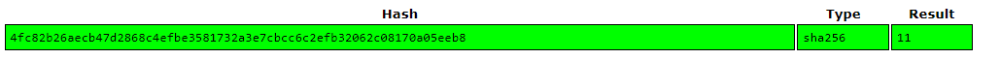
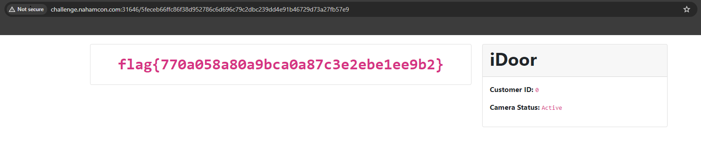

## Challenge 🧩

It's Apple's latest innovation, the "iDoor!" ... well, it is basically the Ring Doorbell camera, but the iDoor offers a web-based browser to monitor your camera, and super secure using ultimate cryptography with even SHA256 hashing algorithms to protect customers! Don't even think about snooping on other people's cameras!!

Author: JohnHammond#6971 </br>

## Solution 🕵️‍♂️

Simple IDOR, the Customer ID is SHA256 of the number.

SHA256 of `11` Customer ID is



So SHA256 of `0` is

```bash
┌──(user㉿shell)-[~]
└─$ echo -n 0 | sha256sum
5feceb66ffc86f38d952786c6d696c79c2dbc239dd4e91b46729d73a27fb57e9  -
```



### Tools Used

> `crackstation`

## Flag 🚩

`flag{770a058a80a9bca0a87c3e2ebe1ee9b2}`
