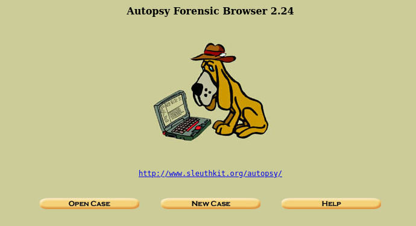
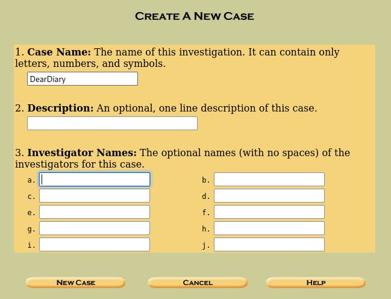
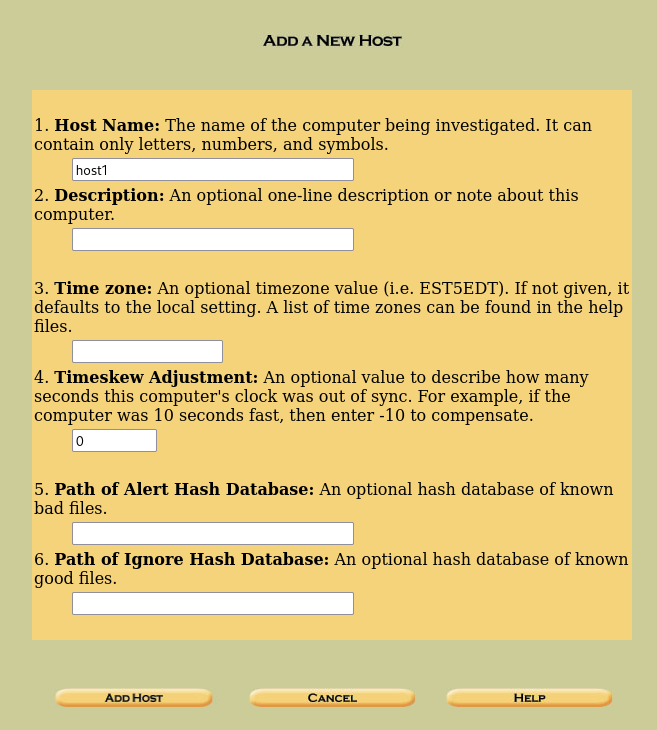
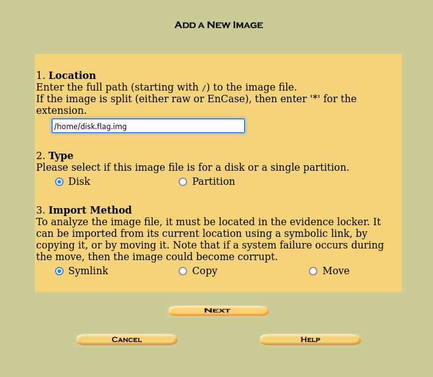
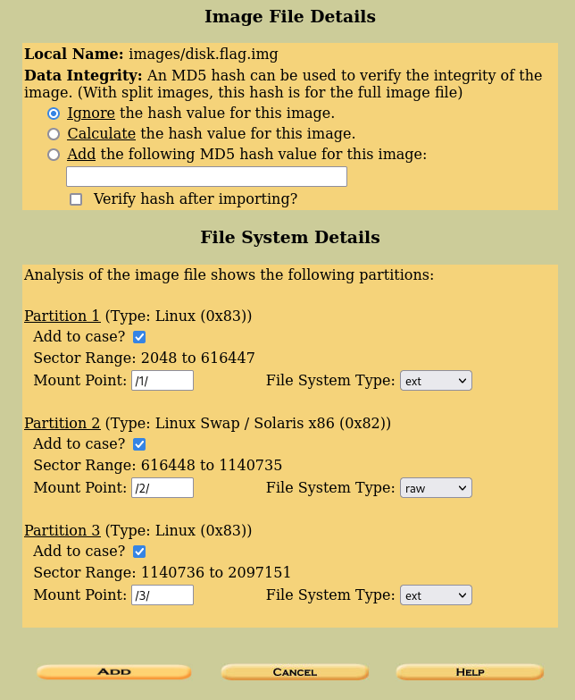
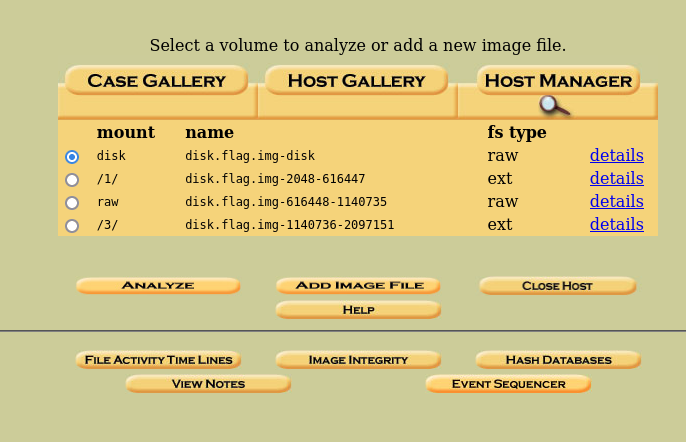
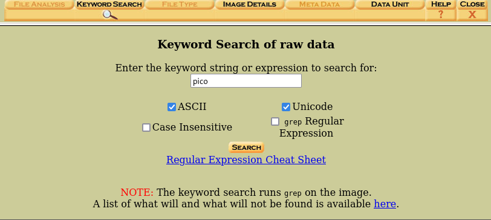
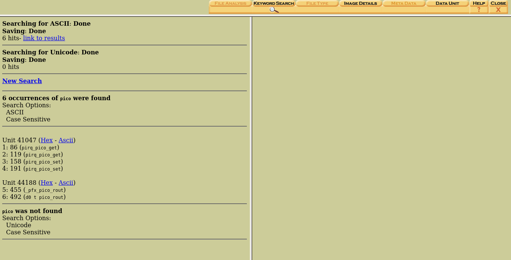
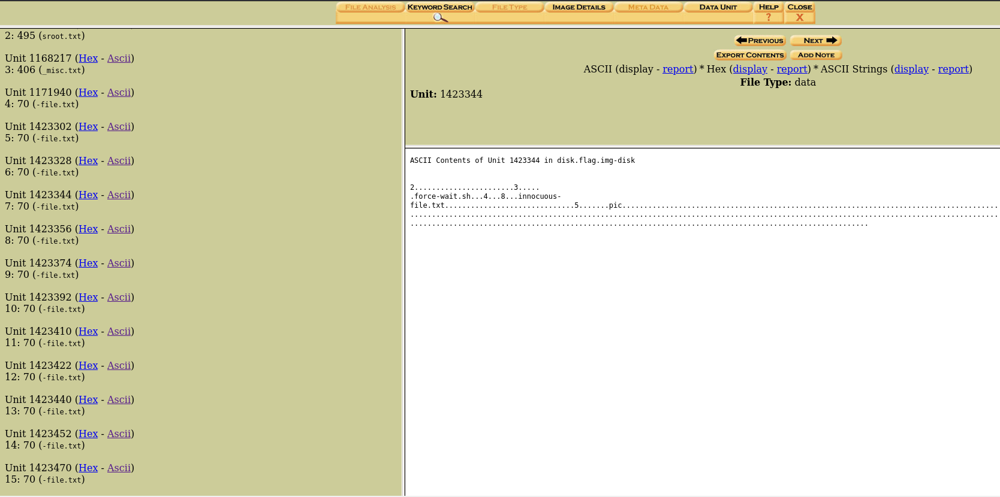

## Challenge 🧩
If you can find the flag on this disk image, we can close the case for good!

Author: SYREAL</br>
Points: 400

Hint: If you're observing binary data raw in the terminal you may be misled about the contents of a block.

## Solution 🕵️‍♂️

```bash
┌──(user㉿shell)-[~]
└─$ sudo autopsy
============================================================================

                       Autopsy Forensic Browser 
                  http://www.sleuthkit.org/autopsy/
                             ver 2.24 

============================================================================
Evidence Locker: /var/lib/autopsy
Remote Host: localhost
Local Port: 9999

Open an HTML browser on the remote host and paste this URL in it:

    http://localhost:9999/autopsy

Keep this process running and use <ctrl-c> to exit
```



Lets create a new case </br>



Click on add host. Lets continue with the defaults </br>



Add the extracted .img file to autopsy </br>




Lets analyze entire disk which has 3 partitions. Click on `Analyze` to continue </br>



Searching for the `pico` keyword yields not-so-helpful results.



Lets try with the `.txt` keyword, after analyzing all results we can find the flag. </br>



`Tool Used: autopsy`

## Flag 🚩

`picoCTF{1_533_n4m35_xxxxxxxx}`
