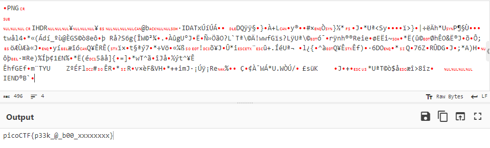

## Challenge 🧩

I've gotten bored of handing out flags as text. Wouldn't it be cool if they were an image instead?

Author: JEFFERY JOHN 
Points: 50

Hints:

1. QR codes are a way of encoding data. While they're most known for storing URLs, they can store other things too.
2. Mobile phones have included native QR code scanners in their cameras since version 8 (Oreo) and iOS 11
3. If you don't have access to a phone, you can also use zbar-tools to convert an image to text

## Solution 🕵️‍♂️

Use any QR Code Scanner/Parser to get the flag.

Tool Used: `CyberChef/Parse_QR_Code`

## Flag 🚩

`picoCTF{p33k_@_b00_xxxxxxxx}`
