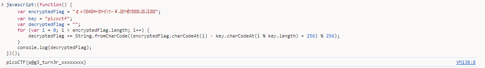

## Challenge 🧩

Why search for the flag when I can make a bookmarklet to print it for me?</br>
Browse here, and find the flag!

Author: JEFFERY JOHN</br>
Points: 50

Hints:

1. A bookmarklet is a bookmark that runs JavaScript instead of loading a webpage.
2. What happens when you click a bookmarklet?
3. Web browsers have other ways to run JavaScript too.

## Solution 🕵️‍♂️

JavaScript Code Block in `textarea`

```js
javascript:(function() {
    var encryptedFlag = "￠ￒￆ￞ﾦ￈ﾬ￫￙ﾣￖﾖￓￚ￥ￛ￑ﾢￕￓ￞￨￡ￛ￧ￛ￬￞￭";
    var key = "picoctf";
    var decryptedFlag = "";
    for (var i = 0; i < encryptedFlag.length; i++) {
        decryptedFlag += String.fromCharCode((encryptedFlag.charCodeAt(i) - key.charCodeAt(i % key.length) + 256) % 256);
    }
    alert(decryptedFlag);
})();
```

We can execute JavaScript Code in browser using console



## Flag 🚩

`picoCTF{p@g3_turn3r_xxxxxxxx}`
