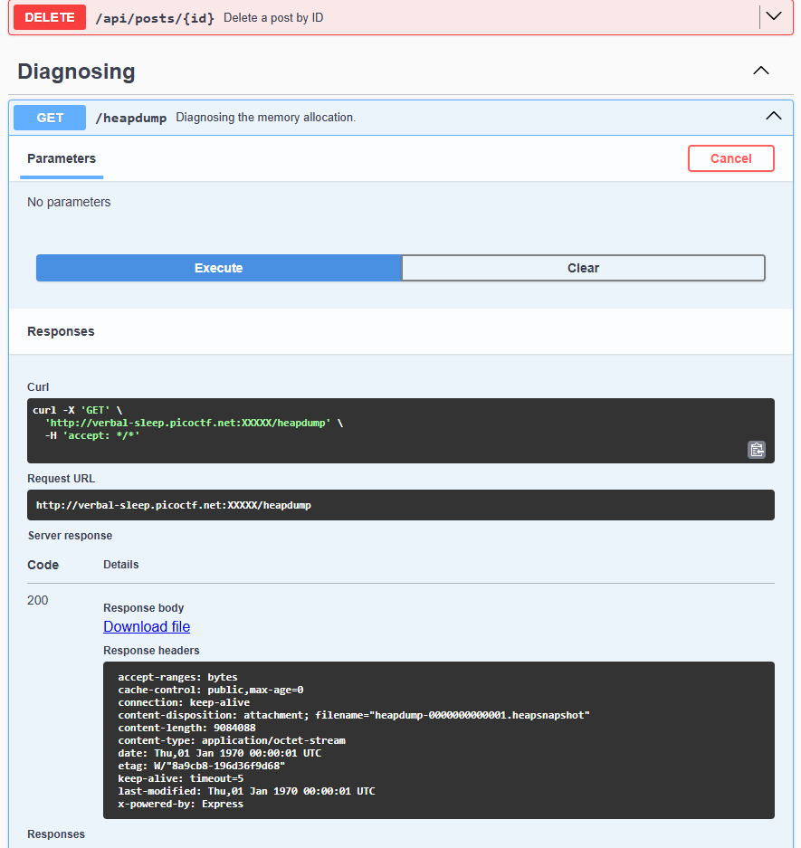

## Challenge 🧩

Welcome to the challenge! In this challenge, you will explore a web application and find an endpoint that exposes a file containing a hidden flag.
The application is a simple blog website where you can read articles about various topics, including an article about API Documentation. Your goal is to explore the application and find the endpoint that generates files holding the server’s memory, where a secret flag is hidden.

Author: Prince Niyonshuti N.</br>
Points: 50

Hints:

1. Explore backend development with us
2. The head was dumped.

## Solution 🕵️‍♂️

Visit `/api-docs` and execute GET `/heapdump`



Download heapdump file.

```bash
┌──(user㉿shell)-[~]
└─$ grep -r "picoCTF"
heapdump-0000000000001.heapsnapshot:picoCTF{Pat!3nt_15_Th3_K3y_xxxxxxxx}
```

## Flag 🚩

`picoCTF{Pat!3nt_15_Th3_K3y_xxxxxxxx}`
